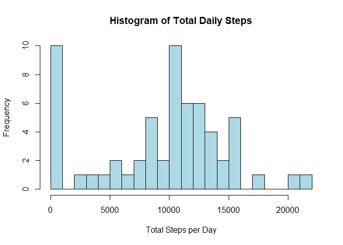
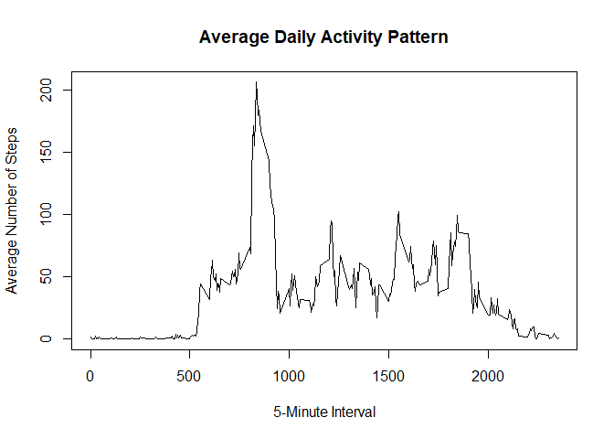
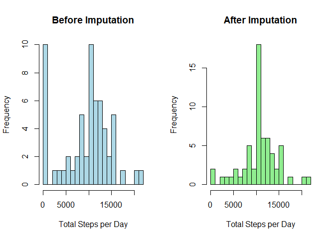
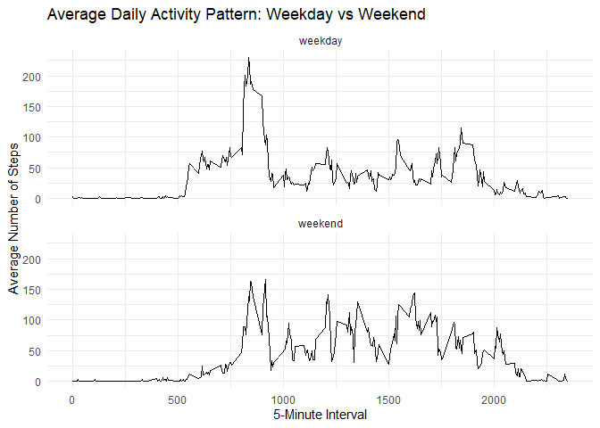

## Loading and preprocessing the data


``` r
library(dplyr)
```

```
## 
## Attaching package: 'dplyr'
```

```
## The following objects are masked from 'package:stats':
## 
##     filter, lag
```

```
## The following objects are masked from 'package:base':
## 
##     intersect, setdiff, setequal, union
```

``` r
library(readr)
library(ggplot2)
```


``` r
# Read CSV directly from zip without extracting
data <- read_csv(unz("activity.zip", "activity.csv"))
```

```
## Rows: 17568 Columns: 3
## ── Column specification ────────────────────────────────────────────────────────
## Delimiter: ","
## dbl  (2): steps, interval
## date (1): date
## 
## ℹ Use `spec()` to retrieve the full column specification for this data.
## ℹ Specify the column types or set `show_col_types = FALSE` to quiet this message.
```


``` r
# View first few rows
head(data)
```

```
## # A tibble: 6 × 3
##   steps date       interval
##   <dbl> <date>        <dbl>
## 1    NA 2012-10-01        0
## 2    NA 2012-10-01        5
## 3    NA 2012-10-01       10
## 4    NA 2012-10-01       15
## 5    NA 2012-10-01       20
## 6    NA 2012-10-01       25
```

``` r
# Get structure of dataset
str(data)
```

```
## spc_tbl_ [17,568 × 3] (S3: spec_tbl_df/tbl_df/tbl/data.frame)
##  $ steps   : num [1:17568] NA NA NA NA NA NA NA NA NA NA ...
##  $ date    : Date[1:17568], format: "2012-10-01" "2012-10-01" ...
##  $ interval: num [1:17568] 0 5 10 15 20 25 30 35 40 45 ...
##  - attr(*, "spec")=
##   .. cols(
##   ..   steps = col_double(),
##   ..   date = col_date(format = ""),
##   ..   interval = col_double()
##   .. )
##  - attr(*, "problems")=<externalptr>
```

``` r
# Summary statistics
summary(data)
```

```
##      steps             date               interval     
##  Min.   :  0.00   Min.   :2012-10-01   Min.   :   0.0  
##  1st Qu.:  0.00   1st Qu.:2012-10-16   1st Qu.: 588.8  
##  Median :  0.00   Median :2012-10-31   Median :1177.5  
##  Mean   : 37.38   Mean   :2012-10-31   Mean   :1177.5  
##  3rd Qu.: 12.00   3rd Qu.:2012-11-15   3rd Qu.:1766.2  
##  Max.   :806.00   Max.   :2012-11-30   Max.   :2355.0  
##  NA's   :2304
```

## What is mean total number of steps taken per day?


``` r
# total steps per day, dropping NAs in the sum

daily_steps <- data %>%
  group_by(date) %>%
  summarize(
    total_steps = sum(steps, na.rm = TRUE),
    .groups = "drop"
  )

# Make a histogram of the daily totals
hist(
  daily_steps$total_steps,
  breaks    = 20,
  main      = "Histogram of Total Daily Steps",
  xlab      = "Total Steps per Day",
  col       = "lightblue"
)
```

<!-- -->

``` r
#Calculate mean and median
mean_steps  <- mean(daily_steps$total_steps)
median_steps <- median(daily_steps$total_steps)

mean_steps
```

```
## [1] 9354.23
```

``` r
median_steps
```

```
## [1] 10395
```


## What is the average daily activity pattern?


``` r
# Calculate average steps per interval across all days
interval_pattern <- data %>%
  group_by(interval) %>%
  summarize(avg_steps = mean(steps, na.rm = TRUE), .groups = "drop")

# Time‐series plot of 5-minute interval vs. average steps
plot(
  interval_pattern$interval,
  interval_pattern$avg_steps,
  type = "l",
  xlab = "5-Minute Interval",
  ylab = "Average Number of Steps",
  main = "Average Daily Activity Pattern"
)
```

<!-- -->

``` r
# Identify the interval with the maximum average steps
max_interval <- interval_pattern$interval[which.max(interval_pattern$avg_steps)]
max_interval
```

```
## [1] 835
```


## Imputing missing values


``` r
# Count missing values 

num_missing <- sum(is.na(data$steps))
message("Total missing 'steps' values: ", num_missing)
```

```
## Total missing 'steps' values: 2304
```

``` r
# Daily totals (ignoring N/As)

daily_orig <- data %>%
  group_by(date) %>%
  summarize(total_steps = sum(steps, na.rm = TRUE), .groups = "drop")

# Impute by interval mean
interval_means <- data %>%
  group_by(interval) %>%
  summarize(mean_steps = mean(steps, na.rm = TRUE), .groups = "drop")

data_imputed <- data %>%
  left_join(interval_means, by = "interval") %>%
  mutate(steps = if_else(is.na(steps), mean_steps, steps)) %>%
  select(date, interval, steps)

# Recompute daily totals after imputation

daily_imp <- data_imputed %>%
  group_by(date) %>%
  summarize(total_steps = sum(steps), .groups = "drop")

# Plot side‐by‐side histograms
par(mfrow = c(1, 2))
hist(daily_orig$total_steps,
     breaks = 20, main = "Before Imputation",
     xlab = "Total Steps per Day", col = "lightblue")
hist(daily_imp$total_steps,
     breaks = 20, main = "After Imputation",
     xlab = "Total Steps per Day", col = "lightgreen")
```

<!-- -->

``` r
par(mfrow = c(1, 1))

# Print mean & median
cat("Before: mean =", mean(daily_orig$total_steps),
    "median =", median(daily_orig$total_steps), "\n")
```

```
## Before: mean = 9354.23 median = 10395
```

``` r
cat(" After: mean =", mean(daily_imp$total_steps),
    "median =", median(daily_imp$total_steps), "\n")
```

```
##  After: mean = 10766.19 median = 10766.19
```


## Are there differences in activity patterns between weekdays and weekends?


``` r
# 1. Add weekday/weekend factor
data_imputed <- data_imputed %>%
  mutate(
    day_type = if_else(
      weekdays(date) %in% c("Saturday", "Sunday"),
      "weekend", 
      "weekday"
    ),
    day_type = factor(day_type, levels = c("weekday", "weekend"))
  )

# 2. Compute average steps by interval and day_type
interval_by_daytype <- data_imputed %>%
  group_by(day_type, interval) %>%
  summarize(avg_steps = mean(steps), .groups = "drop")

# 3. Plot with ggplot2 facets
ggplot(interval_by_daytype, aes(x = interval, y = avg_steps)) +
  geom_line() +
  facet_wrap(~ day_type, ncol = 1) +
  labs(
    title = "Average Daily Activity Pattern: Weekday vs Weekend",
    x     = "5-Minute Interval",
    y     = "Average Number of Steps"
  ) +
  theme_minimal()
```

<!-- -->


